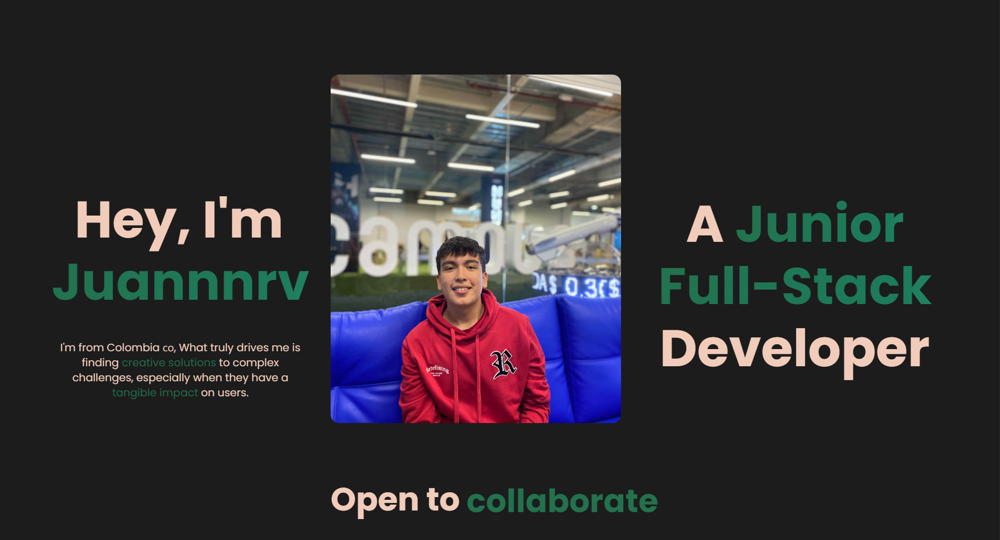
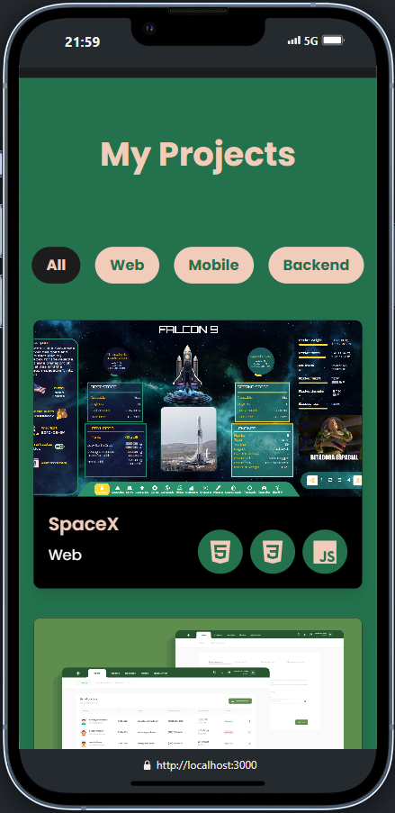

# Portfolio Juannnrv







## Instalación y Ejecución

Para ver el proyecto en tu máquina local:

1. Clona el repositorio:

   ```bash
   git clone https://github.com/Juannnrv/portfolio
   
   cd portfolio

2. Instala las dependencias:
   ```bash
   npm i 
   
3. Inicia el servidor de desarrollo:

    ```bash
    npm run dev

4. Abre tu navegador y ve a http://localhost:3000 para visualizar el portfolio.

## Contacto
Si deseas ponerte en contacto, puedes encontrarme en [Linkedin](https://www.linkedin.com/in/juan-rosas-4580192b8/) o [Email](juandavid15122016@gmail.com) . Abre tu navegador y ve a `http://localhost:3000` para visualizar el portfolio.

